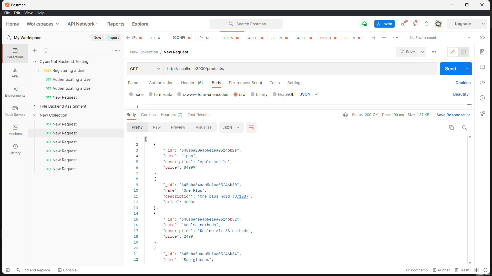
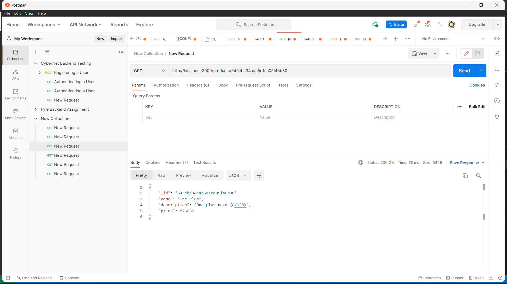
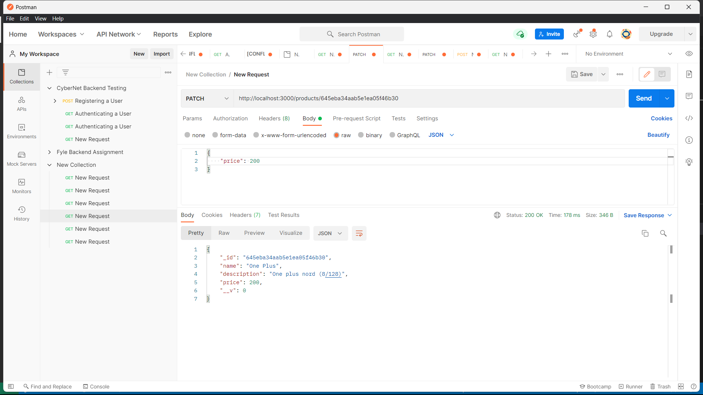
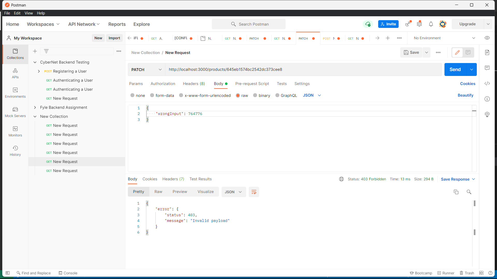
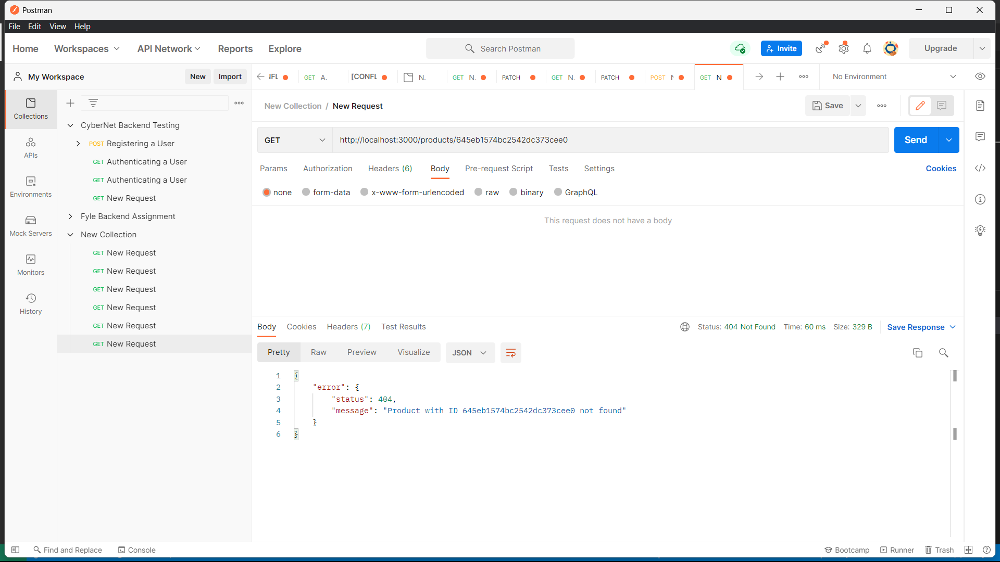

# codemon_assignment
##### -Had fun completing this assignemnt
##### -Completed the following APIs

### 1. GET /products
##### - It displays all the products stored in the database (in the format {_id, name; description, price})

### 2. GET /products/:productID
##### - It displays the details of the product with the specific id passed as parameter

### 3. PATCH /products/:productID
##### - It updates the value of price of the product with specific id passed as parameter

##### - Valid payload must be of the type {"price": 12345}

##### - Performed error handling when: invalid payload is sent (i.e price), product with the mentioned id is not found

